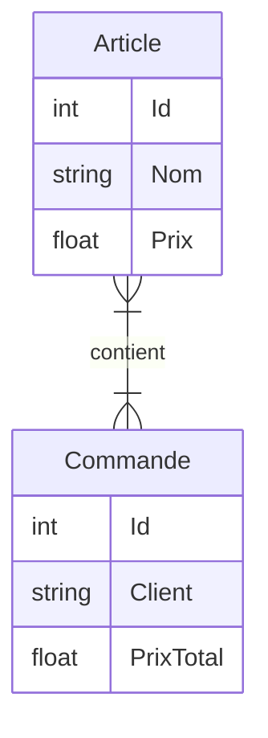
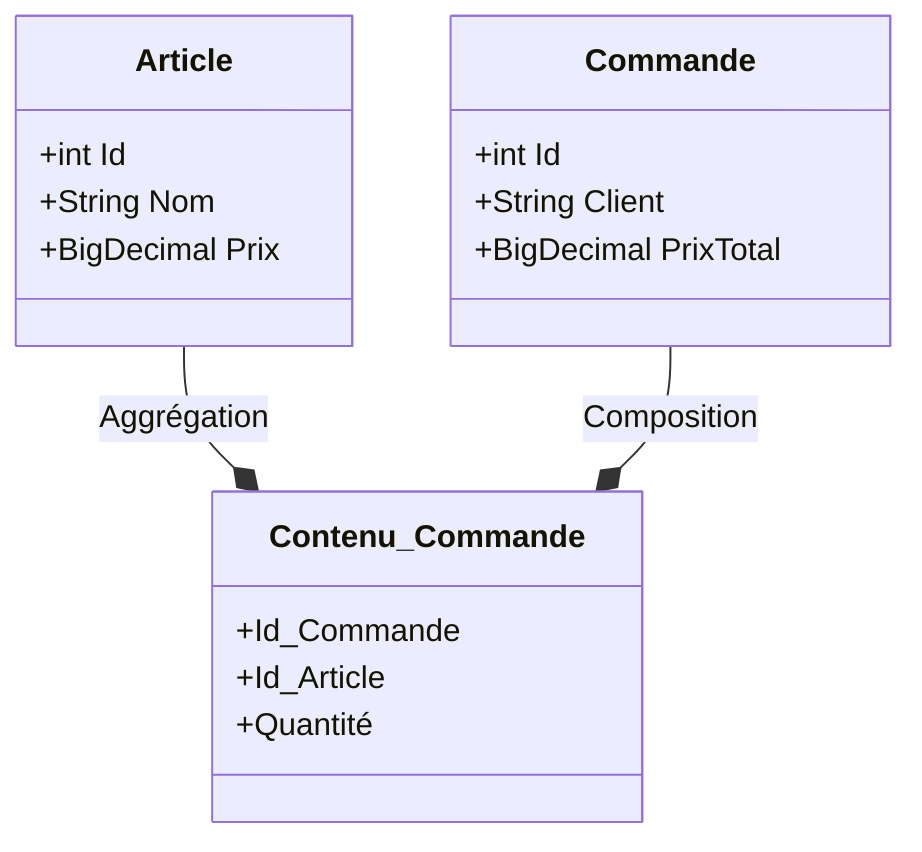

# webservice-order_manager

## Contexte

    Cours Service Web Echange de données EPSI Rennes
    Bachelor 3 Concepteur Développeur d'Application 2022 - 2023
    Implémentation d'un WebService en tenant compte des bonnes pratique REST

    Membres : Stephen Proust, Noé Dubosq, Aurélien Gouriou, Olivier Bricaud

## How to run

```sh
git clone
...
```

## Cahier des charges

### Sujet

* Vous allez devoir mettre en place plusieurs endpoint REST pour gérer les stock d’un magasin.
Vous ne gérer qu’un seul magasin. Vous allez donc gérer un liste d’article qui sera le stock, un article
à une désignation, une quantité et un prix.

* Création d’un CRUD pour gérer des articles

* Ajout d’une gestion de commande. Un article a une quantité dans la commande.
*Note : Une commande contenant un article diminue automatiquement la quantité de l’article en
question dans le stock, la gestion de l’annulation de la commande n’est pas demandé.*

### Contraintes

- SpringBoot
- Base de données relationnelle

## Schéma


<div align="center">



`Diagramme entité relation`
</div>


<div align="center">




`Diagramme de classe`
</div>


## Documentation


| # | route             | méthode    | entrée                 | server status   | observation |
|---|-------------------|------------|------------------------|-----------------|-------------|
| 1 | /articles         | GET        | *                      | 200             | étape1      |
| 2 | /articles/create  | POST       | {nom, prix}            | 200 / 201 / 403 | étape1      |
| 3 | /articles/update  | POST / PUT | {nv_nom, nx_prix}      | 200 / 202 / 204 | étape1      |
| 4 | /articles/delete  | DELETE     | {article_id}           | 200             | étape1      |
| - | -                 | -          | -                      | -               | -           |
| 5 | /commandes        | GET        | *                      | 200             | étape2      |
| 6 | /commandes/create | POST       | {client, articles}     | 200 / 201 / 403 | étape2      |
| - | -                 | -          | -                      | -               | -           |
| 7 | /commandes/update | POST / PUT | {commande_id, nx_data} | 200 / 202 / 204 | optionnelle |
| 8 | /commandes/delete | DELETE     | {commande_id}          | 200             | optionnelle |

<div align="center">

`Tables des endpoints`
</div>


