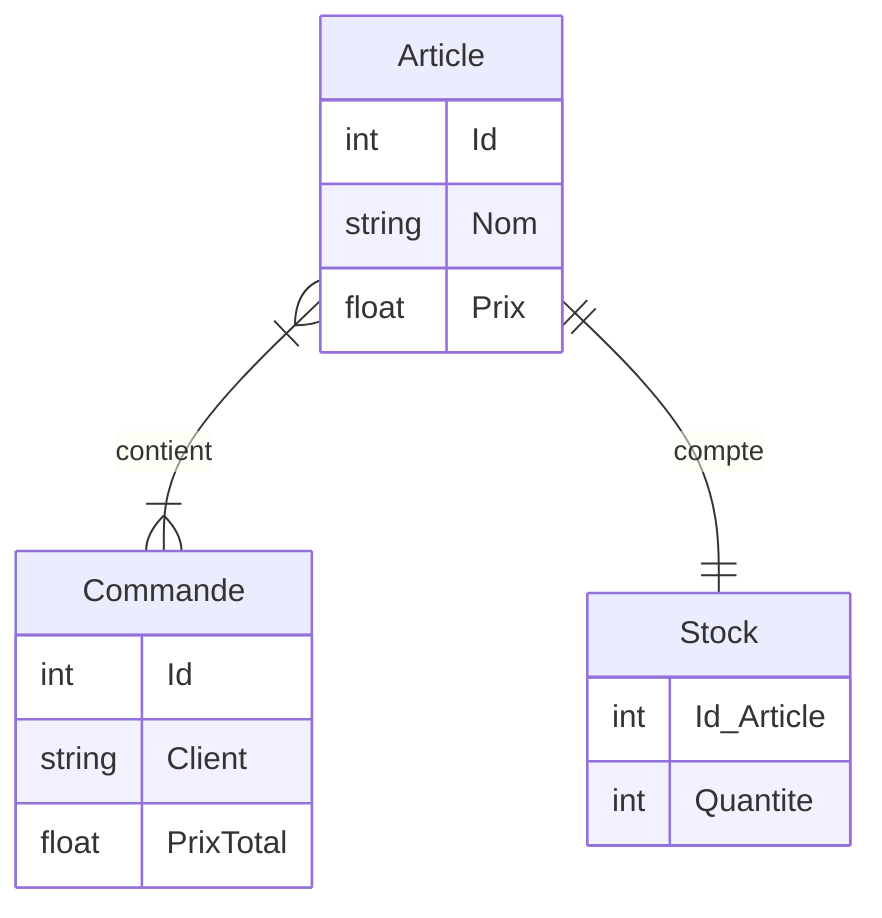
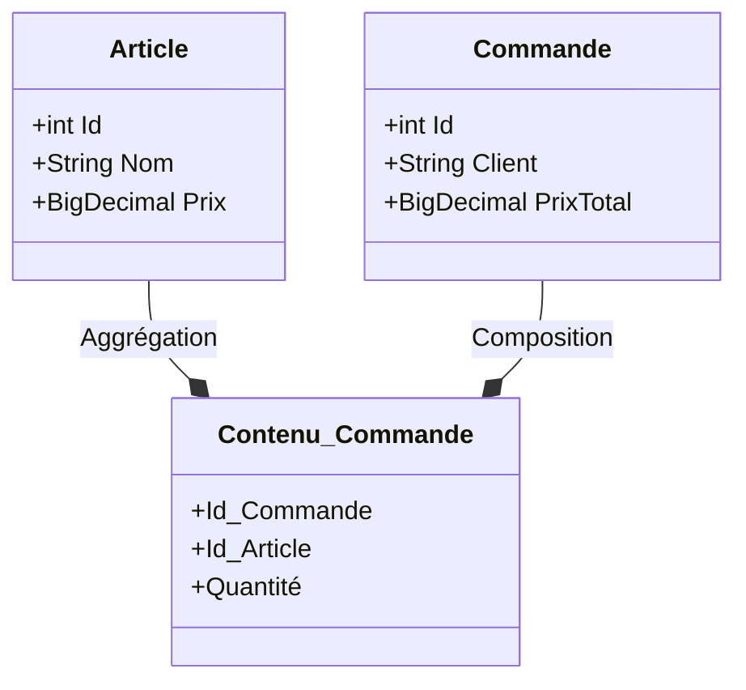
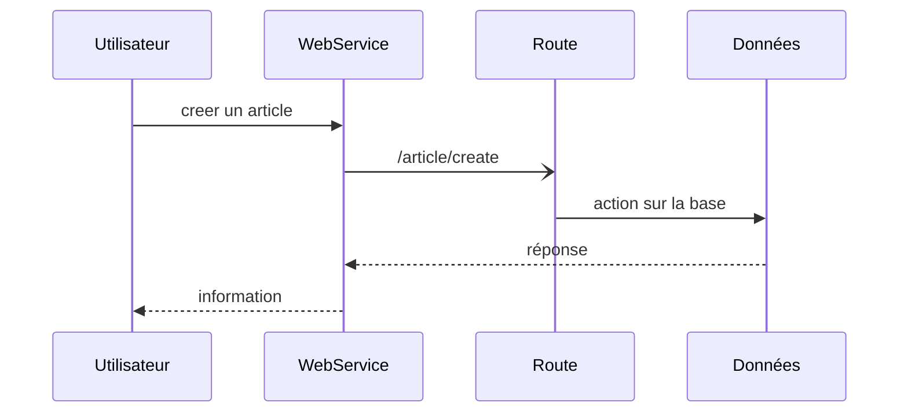
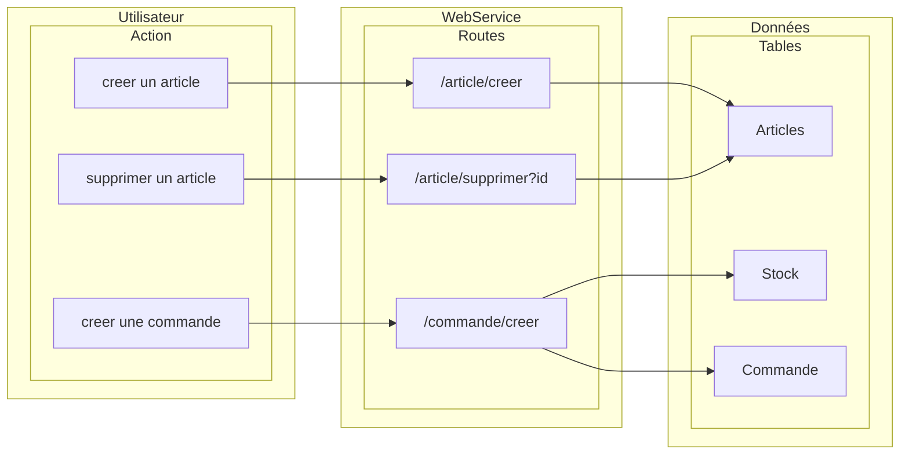

# webservice-order_manager

## Contexte

    Cours Service Web Echange de données EPSI Rennes
    Bachelor 3 Concepteur Développeur d'Application 2022 - 2023
    Implémentation d'un WebService en tenant compte des bonnes pratique REST

    Membres : Stephen Proust, Noé Dubosq, Aurélien Gouriou, Olivier Bricaud

## How install

```shell
git clone https://github.com/Mistayan/webservice-order_manager.git
cd webservice-order_manager
mvn clean install
```

##  (optional) How to buid
```shell
mvn spring-boot:build-image
```

## How to run
```shell
docker compose up
```

## Cahier des charges

### Sujet

* Vous allez devoir mettre en place plusieurs endpoint __REST__ pour gérer les stock d’un magasin.
Vous ne gérer qu’un seul magasin. Vous allez donc gérer une liste d’article qui sera le stock, un article
à une désignation, une quantité et un prix.

* Création d’un __CRUD__ pour gérer des articles.

* Ajout d’une gestion de commande. Un article a une quantité dans la commande. <br>
*<ins>Note</ins> : Une commande contenant un article diminue automatiquement la quantité de l’article en
question dans le stock, la gestion de l’annulation de la commande n’est pas demandé.*

### Contraintes

- SpringBoot
- Base de données relationnelle

## Schéma


<div align="center">



`Diagramme entité relation`
</div>


<div align="center">




`Diagramme de classe`
</div>


## Documentation


| #  | route             | méthode | entrée                 | server status   | observation  |
|----|-------------------|---------|------------------------|-----------------|--------------|
| 1  | /articles/get     | GET     | {id}                   | 200 / 404       | étape1       |
| 2  | /articles/getAll  | GET     | -                      | 200             | étape1       |
| 3  | /articles/create  | POST    | {nom, prix}            | 200 / 201 / 403 | étape1       |
| 4  | /articles/addAll  | POST    | [{nom, ...}, \]        | 200 / 201 / 403 | étape1       |
| 5  | /articles/update  | PUT     | {n_nom, n_prix, n_qty} | 200 / 202 / 204 | étape1       |
| 6  | /articles/delete  | DELETE  | {article_id}           | 200             | étape1       |
| -  | -                 | -       | -                      | -               | -            |
| 7  | /commandes/get    | GET     | {id: UUID}             | 200 / 404       | étape2       |
| 8  | /commandes/create | POST    | {client, articles}     | 200 / 201 / 403 | étape2       |
| -  | -                 | -       | -                      | -               | -            |
| 9  | /commandes/getAll | GET     | *                      | 200             | optionnelle  |
| 10 | /commandes/update | PUT     | {id, nx_data}          | 200 / 202 / 204 | optionnelle  |
| 11 | /commandes/delete | DELETE  | {id: UUID}             | 200             | optionnelle  |

<div align="center">

`Tables des endpoints`
</div>


<div align="center">

`Diagramme de séquence`
</div>


<div align="center">

`Diagramme de cas d'utilisation`
</div>


## Architecture REST (Representational State Transfer) 

```txt
Architecture SOAP mise en place dans un premier temps (montée en compétences en lien avec les entreprises des membres du groupe).

Architecture REST : TODO
```