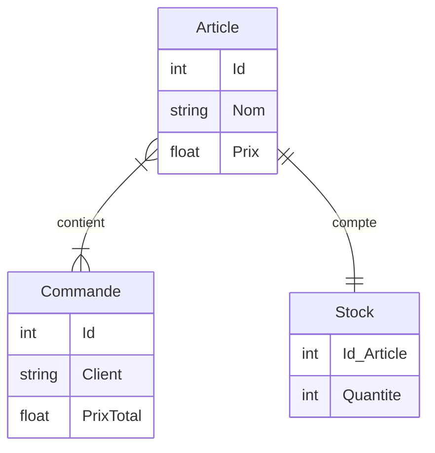
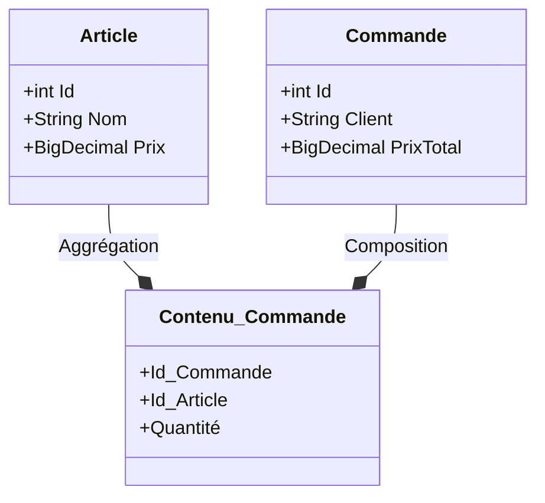
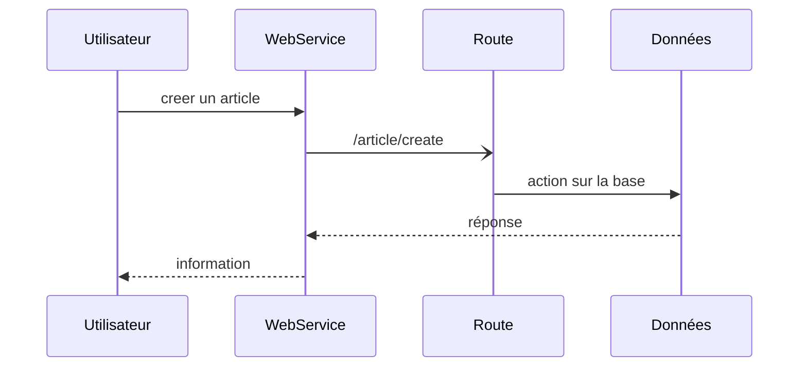
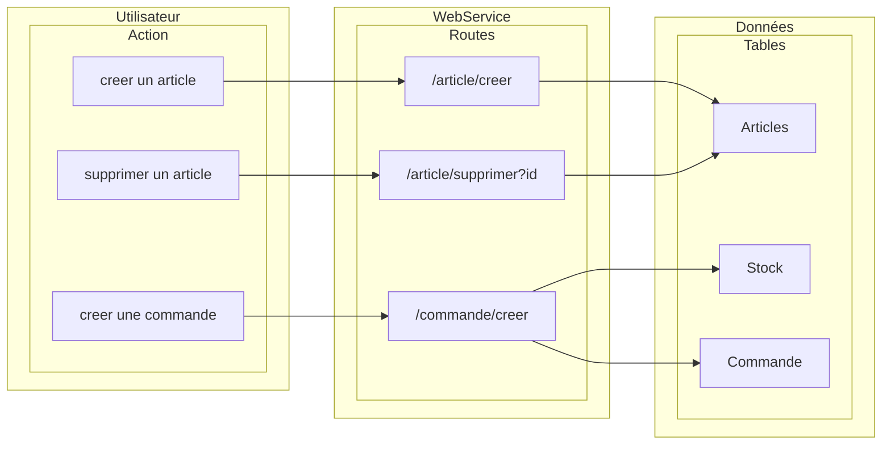

# webservice-order_manager

## Contexte

    Cours Service Web Echange de données EPSI Rennes
    Bachelor 3 Concepteur Développeur d'Application 2022 - 2023
    Implémentation d'un WebService en tenant compte des bonnes pratique REST

    Membres : Stephen Proust, Noé Dubosq, Aurélien Gouriou, Olivier Bricaud

## Récupérer le projet

```shell
git clone https://github.com/Mistayan/webservice-order_manager.git
cd webservice-order_manager
```

### Installer le projet (Optionnel)
```shell
mvn clean install
mvn build
```

###  Comment lancer l'application (springboot + h2) (Optionnel)
Cette méthode ne permet pas de persister les données. (version d'essai) 
```shell
mvn spring-boot:run
```

## Utiliser l'application avec une persistance de données
Cette méthode utilise une version Dockerisée et déployable de l'application. ( BDD postgresql )

### PREREQUIS
- docker
- docker compose

### BUILD (optionnel, l'image est déjà disponible en ligne)
```shell
mvn spring-boot:build-image
```

### RUN
```shell
docker compose up
```

### Pour un front permettant de tester l'application :
```shell
git clone https://gitlab.com/hylozoisme/order-manager-front.git
```

## How to use :
L'app est accessible à l'adresse : http://localhost:1117/
Les routes disponibles sont listées dans la section [Documentation](#documentation)

La console administrateur h2 est accessible à l'adresse : http://localhost:1117/admn/h2-console  (user: manager, password: 1234)
(permet de visualiser les données en base de données)

## Cahier des charges

### Sujet

* Vous allez devoir mettre en place plusieurs endpoint __REST__ pour gérer les stock d’un magasin.
Vous ne gérer qu’un seul magasin. Vous allez donc gérer une liste d’article qui sera le stock, un article
à une désignation, une quantité et un prix.

* Création d’un __CRUD__ pour gérer des articles.

* Ajout d’une gestion de commande. Un article a une quantité dans la commande. <br>
*<ins>Note</ins> : Une commande contenant un article diminue automatiquement la quantité de l’article en
question dans le stock, la gestion de l’annulation de la commande n’est pas demandé.*

### Contraintes

- SpringBoot
- Base de données relationnelle

## Schéma


<div align="center">



`Diagramme entité relation`
</div>


<div align="center">




`Diagramme de classe`
</div>


## Documentation


| #  | route             | méthode | entrée                 | server status   | observation  |
|----|-------------------|---------|------------------------|-----------------|--------------|
| 1  | /articles/get     | GET     | {id}                   | 200 / 404       | étape1       |
| 2  | /articles/all     | GET     | -                      | 200             | étape1       |
| 3  | /articles/create  | POST    | {nom, prix}            | 200 / 201 / 403 | étape1       |
| 4  | /articles/addAll  | POST    | [{nom, ...}, \]        | 200 / 201 / 403 | étape1       |
| 5  | /articles/update  | PUT     | {n_nom, n_prix, n_qty} | 200 / 202 / 204 | étape1       |
| 6  | /articles/delete  | DELETE  | {article_id}           | 200             | étape1       |
| -  | -                 | -       | -                      | -               | -            |
| 7  | /commandes/get    | GET     | {id: UUID}             | 200 / 404       | étape2       |
| 8  | /commandes/create | POST    | {client, articles}     | 200 / 201 / 403 | étape2       |
| -  | -                 | -       | -                      | -               | -            |
| 9  | /commandes/all    | GET     | *                      | 200             | optionnelle  |
| 10 | /commandes/update | PUT     | {id, nx_data}          | 200 / 202 / 204 | optionnelle  |
| 11 | /commandes/delete | DELETE  | {id: UUID}             | 200             | optionnelle  |

<div align="center">

`Tables des endpoints`
</div>

Dans le cadre de l'exercice, l'authentification n'a pas été mise en place.

## Admin Story :
- L'admin peut créer un/plusieurs articles à la fois

POST /articles/addAll
Body : 
```json
[
  {
  "name": "gibson sg",
  "unitPrice": "1250.00",
  "quantity": 10
  },
    {
  "name": "fender stratoctaster",
  "unitPrice": "1100.00",
  "quantity": 10
  },
    {
  "name": "fender telecaster",
  "unitPrice": "1200.00",
  "quantity": 10
  },
    {
  "name": "gibson explorer",
  "unitPrice": "1000.00",
  "quantity": 10
  },
    {
  "name": "squier telecaster",
  "unitPrice": "650.00",
  "quantity": 10
  },
    {
  "name": "epiphone lespaul",
  "unitPrice": 800.00,
  "quantity": 10
  }
]
```

Le mec change un article suite à une fausse manip: (maj prix + maj stock)
PUT /articles/update
Body : 
```json
  {
  "id": 1,
  "name": "gibson sg",
  "unitPrice": "1250.75",
  "quantity": 3
    }
```

User Story :

Je créer une commande avec les articles selectionnés sur la page:
POST /commandes/create
Body : 
```json
      {
      "customerName": "Bob",
      "orderItems": [{"id": 1}, {"id": 1}, {"id": 2}, {"id": 3}]
      }
```
-> Retourne UUID

je regarde ma commande:
GET /commandes/get
Body : 
```json
{"id": "UUID"}
```

Réponse:
Body : 
```json
{
    "id": "UUID",
    "customerName": "Bob",
    "orderItems": [
        {
            "id": 1,
            "name": "gibson sg",
            "unitPrice": 1250.75,
            "quantity": 2,
            "archived": false
        },
        {
            "id": 2,
            "name": "fender stratoctaster",
            "unitPrice": 1100.0,
            "quantity": 1,
            "archived": false
        },
        {
            "id": 3,
            "name": "fender telecaster",
            "unitPrice": 1200.0,
            "quantity": 1,
            "archived": false
        }
    ],
    "totalPrice": 4801.5
}
```

l'admin regarde toutes les commandes passées :

GET /commandes/all
-> toutes les commandes passées et leur prix.


<div align="center">

`Diagramme de séquence`
</div>


<div align="center">

`Diagramme de cas d'utilisation`
</div>


## Architecture REST (Representational State Transfer) 

```txt
Architecture SOAP mise en place dans un premier temps (montée en compétences en lien avec les entreprises des membres du groupe).

Architecture REST : TODO
```